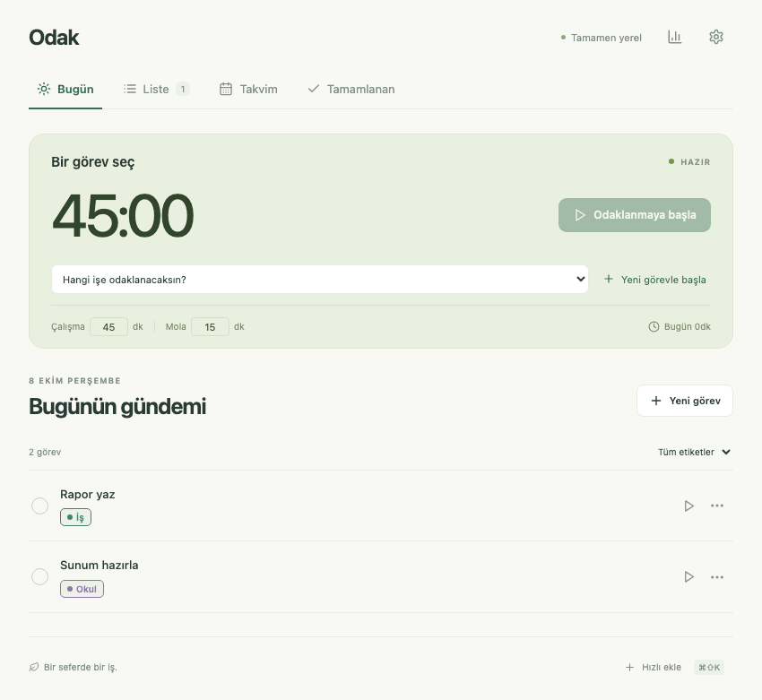
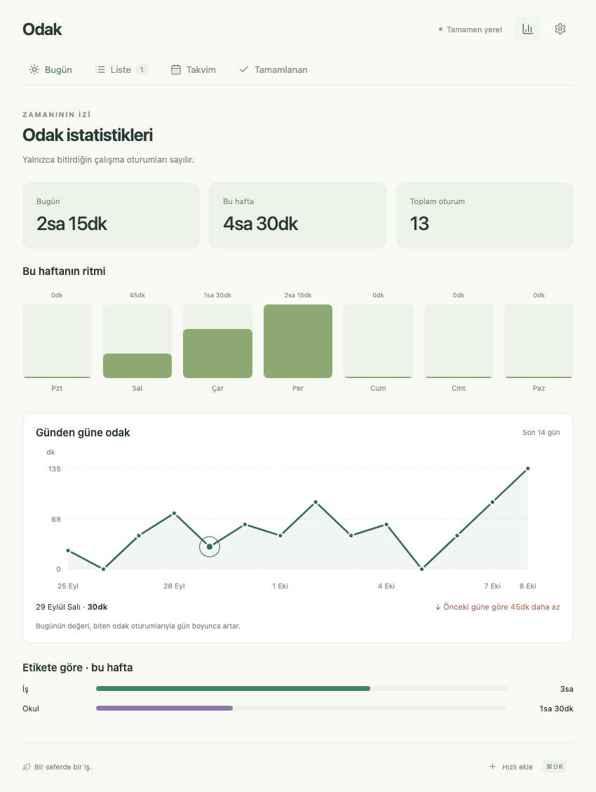

# Odak

**Odaklan, planla, tamamla.** Odak, macOS menü çubuğunda yaşayan Türkçe bir Pomodoro ve görev planlayıcıdır. Odak uygulamasında hesap, sunucu, telemetri veya dış takvim bağlantısı yoktur. Veriler yerel SQLite’ta kalır. İsteyenler bu Mac’e ayrıca günlük Drive yedekleme yardımcısı kurabilir.



## İndir ve kur

1. [Releases](https://github.com/mahmut-cskn/odak-macos/releases) sayfasından en yeni **Odak … universal.dmg** dosyasını indir. Aynı paket Apple Silicon ve Intel Mac’lerde çalışır; macOS 11 veya sonrası gerekir.
2. DMG’yi aç, **Odak** uygulamasını **Applications / Uygulamalar** klasörüne sürükle.
3. Uygulamalar’dan Odak’ı aç. Arayüz doğrudan görünür; Node.js, Rust veya bir editör kurman gerekmez.
4. İlk açılıştaki bildirim iznine **İzin Ver** de. Gerekirse **Sistem Ayarları → Bildirimler → Odak** bölümünden bildirimleri, afişleri ve sesleri aç.

Paket Apple Developer sertifikası olmadan **ad-hoc** imzalanır, Apple tarafından noterlenmemiştir. macOS engellerse uygulamaya **sağ tık → Aç** yap veya **Sistem Ayarları → Gizlilik ve Güvenlik → Yine de Aç** yolunu kullan. İndirme kaynağının bu depo olduğundan emin olduktan sonra gerekirse Terminal’de:

```sh
xattr -cr /Applications/Odak.app
```

DMG indirmeleri için SHA-256 dosyası da aynı Release’te bulunur.

## Kullanım

- **Bugün:** Günün gündemi ve sayaç. Görevin sağındaki ▶ ile ona bağlı oturum başlat veya sayaçtan bir görev seç. **Yeni görevle başla** önce adı olan bir görev oluşturur; görevsiz yeni odak başlatılamaz. Sayaçtaki görev adına tıklayınca yalnızca adını düzenlersin, süre etkilenmez.
- **Liste:** Tarih veya süre vermeden görev ekle. `…` menüsünden bugüne, yarına veya istediğin güne taşı.
- **Takvim:** Ay görünümünde tekrarların gelecekteki günlerini de gör; bir gün seç; o günün görevlerini, geçmişte tamamlananlar dahil gör. **Bu güne görev ekle** ile ileri bir tarihe plan yap.
- **Tamamlanan:** Görevin solundaki yuvarlakla tamamla. Buradaki ✓ yuvarlağına yeniden basınca görev eski gününe/listesine geri döner. **Biten odak oturumları** altında eski görevsiz oturumlar dahil çalışma geçmişini de görürsün; oturum bitmesi görevi tamamlamaz.
- **Ayarlar:** Çalışma **1–90 dakika**, mola **1–30 dakika**; varsayılan **45/15**. Serbest giriş vardır, hazır süre ön ayarları yoktur.

**Pomodoro görevi kendiliğinden tamamlamaz.** Bitmiş çalışma oturumları görevin toplam odak süresine eklenir. Tahmin girdiysen toplam süre tahminle birlikte gösterilir. Uzun bir işi günün gündemine alıp birden fazla oturumla ilerletebilirsin.

**Duraklat / Devam et** kalan süreyi korur. **İptal et** yalnızca o anki oturumu siler, hiçbir süre eklemez; önceden bitmiş oturumlar korunur. Çalışma bitince mola başlar; mola sonunda **Devam et** veya **5 dk daha** seçersin. Uygulamanın penceresini kapatmak sayacı durdurmaz. Menü çubuğundan **Çık** ile tamamen kapatsan bile tekrar açıldığında sayaç kayıtlı zaman damgasından hesaplanır. Uygulama tamamen kapalıyken bildirim gönderilemez; açılınca süresi geçen oturumlar kaydedilir.

## Planlama ve ek özellikler

- Süresiz görev, tahmini süre, son bitirme zamanı ve tarih + saat aralığı desteklenir.
- Saat aralıklı görevler başlamadan **15 dakika önce** sistem bildirimi gelir; bu süre ayarlardan değiştirilir. Başlangıç saati geçip bitişi henüz gelmemiş bir hatırlatma uygulama yeniden açıldığında gönderilir.
- Etiket ve renk seç. Ayarlar’dan etiket oluştur veya seçim listesinden sil; silme mevcut görevlerin etiketini veya rengini değiştirmez. Yeni bir etiket yazınca otomatik oluşturma devam eder. Seçilen etiketin rengi yeni görev için varsayılandır; renk düzenleme diğer görevleri değiştirmez. Liste, Bugün, Tamamlanan ve Takvim’de etiket filtresi kullan.
- Günlük, seçili haftalık günler ve aylık tekrarlar vardır. Her günün örneği bağımsızdır; birini tamamlamak seriyi bitirmez. Aylık 31 gibi bir tarih olmayan aylarda atlanır. Seriyi Liste’nin altından düzenle. Seri düzenlemeleri gelecekteki başlanmamış örneklere uygulanır; tamamlananlar ve süre harcanmış örnekler korunur. Seriyi silmek gelecekteki başlanmamış örnekleri de kaldırır.
- Göreve not ve alt görev ekle. Gün seçimi isteğe bağlıdır; alt görevler ana görevin gününü kullanır. Tekrar için gün zorunlu olduğunda seçili takvim günü (Liste’de bugün) hazır gelir. Zorunlu alanlarda hafif kırmızı kenarlık vardır. Alt görevlerin hepsi bitince ana görevi tamamlaman önerilir; otomatik tamamlanmaz.
- İstatistik simgesinden günlük/haftalık odak süresi, haftalık çubuklar ve etiket dağılımını gör. Ek olarak son 14 günün çizgi grafiğindeki noktalara tıklayıp önceki güne göre artış/azalışı karşılaştır.
- Varsayılan **⌘⇧K** global kısayolu küçük bir hızlı ekleme penceresi açar. Başlığı yazıp **Enter** ile tarihsiz listeye kaydet; **Esc** ile kapat. Kısayol ayarlardan değiştirilir.
- Sistem açık/koyu temasını izler. Dock simgesi yoktur; menü çubuğu ikonuna basınca pencere açılır/kapanır. Sağ tık menüsünde **Çık** bulunur.

## Sesler ve otomatik başlatma

Yalnızca iki özgün, sinüsle sentezlenmiş yumuşak ses vardır: **Çalışma bitti** ve **Mola bitti**. Tik-tak sesi yoktur. Pomodoro bildirimi sessizdir, tonu Rust çalar; çift ses oluşmaz. Plan hatırlatmaları macOS’un sistem bildirim sesini kullanır. **Sesleri çal** ve **ses seviyesi** pomodoro tonlarını ayarlar. **Sessiz mod** tüm sesleri kapatır; bildirimler görünmeye devam eder.

**Oturum açınca başlat** ilk açılışta açıktır. Böylece menü çubuğunda yaşayan Odak planlı hatırlatmaları gönderebilir. Ayarlardan kapatabilirsin. Uygulamayı önce Uygulamalar klasörüne taşı; başlangıç kaydı uygulamanın kurulu yolunu kullanır.

## Yerel veri ve yedekleme

SQLite dosyası `~/Library/Application Support/com.mahmutcskn.odak/odak.sqlite3` konumundadır. Tam yol Ayarlar’da görünür. Görevler, bitmiş oturumlar, sayaç, ayarlar ve gönderilen hatırlatma kayıtları işlem bütünlüğüyle saklanır.

**Ayarlar → JSON dışa aktar** tüm veriyi tek dosyaya kaydeder. **JSON içe aktar** mevcut verilerin yerini seçtiğin yedekle değiştirir; önce otomatik `recovery-….json` kurtarma yedeği alınır. Çalışan/duraklatılmış sayacı içe aktarmadan önce iptal et. Aktif sayaç dışa aktarılabilir. Yedekler görev notlarını da içerdiğinden dosyanı güvenli bir yerde tut.

Etiket seçim listesi `labels.json` dosyasında ayrıca saklanır; mevcut SQLite şeması ve eski görev kayıtları için dönüşüm yapılmaz. JSON dışa aktarma görevleri/oturumları/sayacı/ayarları içerir; ayrı etiket seçim listesi Drive ZIP yedeğinde de bulunur.

### İsteğe bağlı günlük Google Drive yedeği

[Kurulum ve geri yükleme](docs/DRIVE_BACKUP.md). Yardımcı Odak’tan ayrı bir macOS LaunchAgent’tır; uygulamanın içinde ağ bağlantısı veya giriş ekranı yoktur. Mevcut Obsidian yedekleme iznini kullanabilir. Her gün **23:55**’te salt okunur SQLite bağlantısıyla tutarlı bir kopya alır ve Drive’daki **Odak** klasörüne ZIP gönderir. Çalışan sayacı kapatmaz veya değiştirmez. Uyku/çevrimdışı durumunda saatlik kontrolde tekrar denenir. ZIP içinde tek dosyalı SQLite, içe aktarılabilir JSON ve varsa etiket seçim listesi bulunur. Eski yedekler otomatik silinmez.

### Çalışan sayaç sırasında sürüm güncellemesi

Yeni DMG’yi sayaç çalışırken mevcut uygulamanın üzerine kurma. Oturumunu bitir, menü çubuğundan **Çık** seç, sonra yeni paketi Applications’a sürükle. Uygulama verileri ayrı app-data klasöründe kalır; v1.2.0 için şema değişikliği veya eski görev dönüştürmesi yoktur.



## Geliştirme

Son kullanıcı için gerekli değildir. Geliştirici gereksinimleri: macOS, Xcode Command Line Tools, Node.js LTS, Rust stable.

```sh
npm ci
npm run tauri dev
npm test
python3 -m unittest discover -s tests/backup -v
cargo test --manifest-path src-tauri/Cargo.toml --lib
npx playwright install chromium
npm run test:ui
rustup target add aarch64-apple-darwin x86_64-apple-darwin
npm run tauri build -- --target universal-apple-darwin
```

`v*` etiketi push edildiğinde GitHub Actions universal DMG oluşturup Release’e ekler. SQLite `rusqlite` ile pakete gömülüdür; zamanlayıcı, bildirim zamanlaması, ses ve menü çubuğu Rust’ta çalışır. React/TypeScript arayüz ve istatistikleri yönetir. macOS izin penceresi ve afişler için küçük bir `UNUserNotificationCenter` köprüsü kullanılır. Üretim arayüzü dış kaynağa ağ isteği yapamaz.

[Kararlar](DECISIONS.md) · [Doğrulama](docs/VALIDATION.md)
